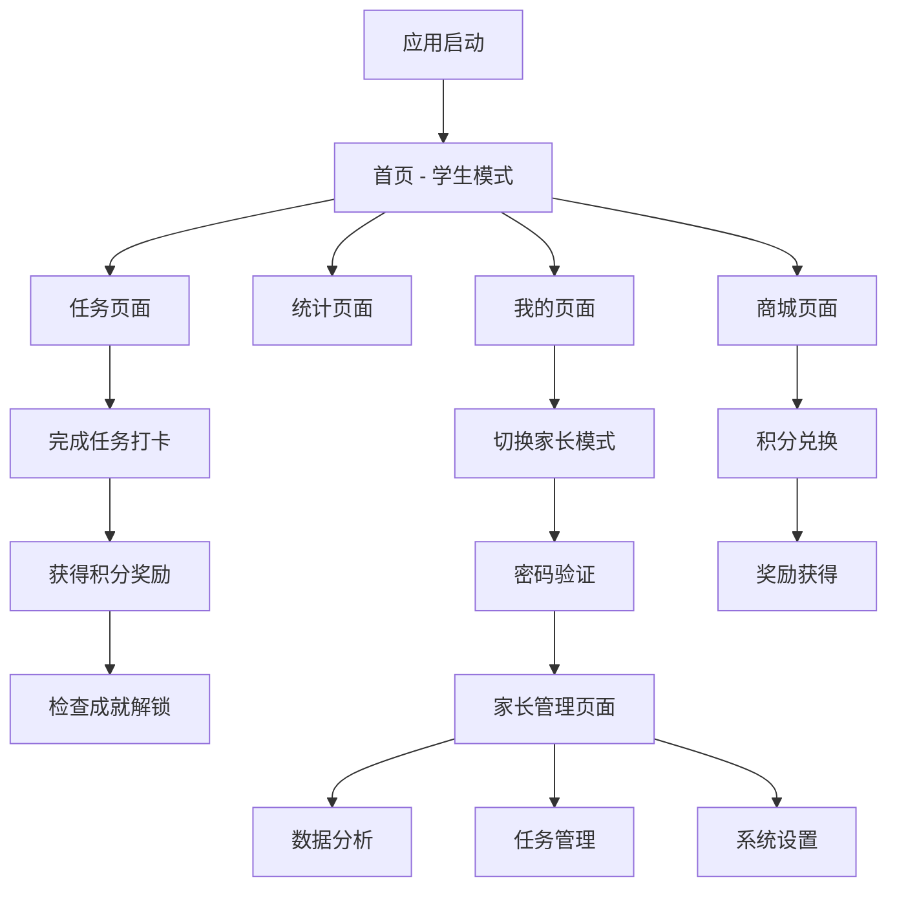

# 每日打卡应用 - 产品需求说明书

## 1. 产品概述

每日打卡是一款专为学生和家长设计的任务管理与习惯养成应用，通过游戏化的积分系统和成就机制，帮助学生建立良好的学习和生活习惯。
应用支持学生自主管理和家长监督两种模式，通过智能任务分类和数据统计，为家庭教育提供科学的数据支持和激励机制。

## 2. 核心功能

### 2.1 用户角色

| 角色 | 切换方式 | 核心权限 |
|------|----------|----------|
| 学生用户 | 默认模式 | 查看任务、完成打卡、查看统计、兑换奖励、添加临时任务（1积分） |
| 家长用户 | 密码验证切换 | 所有学生权限 + 设置任务积分（1-10分）、查看详细数据分析、管理奖励系统 |

### 2.2 功能模块

我们的每日打卡应用包含以下主要页面：
1. **首页**：用户信息展示、今日任务概览、快速打卡入口、成就展示
2. **任务页面**：任务列表管理、智能分类显示、任务添加、完成状态切换
3. **统计页面**：数据可视化图表、完成率统计、历史记录、连续打卡天数
4. **我的页面**：个人信息、积分余额、成就系统、设置选项
5. **商城页面**：积分兑换、奖励列表、兑换历史
6. **家长管理页面**：数据分析、任务积分管理、密码设置、详细报告导出

### 2.3 页面详情

| 页面名称 | 模块名称 | 功能描述 |
|----------|----------|----------|
| 首页 | 用户信息区 | 显示用户头像、姓名、等级、总积分，支持快速查看个人状态 |
| 首页 | 今日任务概览 | 展示今日待完成任务数量、完成进度条、快速打卡按钮 |
| 首页 | 成就展示 | 显示最近解锁的成就，激励用户持续使用 |
| 任务页面 | 智能任务分类 | 按学校任务、家庭任务、临时任务自动分类显示 |
| 任务页面 | 任务管理 | 添加新任务、设置任务类型和频率、删除任务功能 |
| 任务页面 | 打卡功能 | 一键完成任务、积分奖励提示、完成动画效果 |
| 统计页面 | 数据图表 | 周完成率柱状图、月度趋势图、任务类型分布 |
| 统计页面 | 历史记录 | 按日期查看历史完成情况、详细任务记录 |
| 我的页面 | 个人资料 | 编辑用户信息、头像选择、个性化设置 |
| 我的页面 | 成就系统 | 查看所有成就、解锁条件、成就进度 |
| 我的页面 | 系统设置 | 模式切换、数据导出、清空数据、关于应用 |
| 商城页面 | 奖励兑换 | 使用积分兑换奖励、查看兑换条件 |
| 商城页面 | 兑换历史 | 查看历史兑换记录、奖励使用状态 |
| 家长管理页面 | 数据分析 | 本周完成率、平均每日积分、连续打卡天数统计 |
| 家长管理页面 | 任务管理 | 查看所有任务列表、编辑任务名称、调整任务积分奖励、删除任务、添加新任务 |
| 家长管理页面 | 系统管理 | 修改家长密码、设置提醒、导出详细数据报告 |

## 3. 核心流程

### 学生用户流程
学生用户进入应用后，首先看到首页的个人信息和今日任务概览。点击任务页面可以查看按类型分类的任务列表，通过点击任务完成打卡并获得积分奖励。在统计页面可以查看自己的完成情况和数据分析。通过我的页面可以查看成就、管理个人信息，并可以切换到家长模式。在商城页面可以使用积分兑换奖励。

### 家长用户流程
家长用户通过输入6位数字密码验证身份后，进入专门的家长管理页面。可以查看孩子的详细数据分析，包括本周完成率、平均每日积分等。在任务管理板块中，可以查看所有任务列表，编辑任务名称，调整任务积分奖励（1-50分），删除不需要的任务，以及添加新的任务。还可以修改家长密码，导出详细的数据报告用于分析孩子的习惯养成情况。

## 4. 用户界面设计

### 4.1 设计风格
- **主色调**：蓝色系 (#007bff) 作为主色，绿色 (#28a745) 表示完成状态，橙色 (#ffc107) 表示警告
- **按钮风格**：圆角矩形按钮，具有轻微阴影效果，支持点击反馈动画
- **字体**：系统默认字体，标题使用16-18px，正文使用14px，辅助信息使用12px
- **布局风格**：卡片式设计，清晰的层次结构，底部导航栏固定
- **图标风格**：使用Emoji表情符号，简洁直观，易于理解

### 4.2 页面设计概览

| 页面名称 | 模块名称 | UI元素 |
|----------|----------|---------|
| 首页 | 用户信息区 | 圆形头像、用户名、等级标识、积分数字，使用渐变背景卡片 |
| 首页 | 任务概览 | 进度条显示完成百分比，使用蓝色到绿色渐变，数字统计 |
| 任务页面 | 任务列表 | 卡片式布局，左侧任务图标，右侧积分显示，完成状态用绿色对勾 |
| 任务页面 | 添加按钮 | 浮动操作按钮，蓝色圆形，加号图标，固定在右下角 |
| 统计页面 | 图表区域 | 柱状图使用蓝色渐变，背景网格线，数据标签清晰可读 |
| 我的页面 | 设置列表 | 列表项使用分割线，右侧箭头指示，点击有反馈效果 |
| 商城页面 | 奖励卡片 | 商品图标、名称、积分价格，兑换按钮使用主色调 |
| 家长管理页面 | 数据卡片 | 统计数字突出显示，使用大字号，配色区分不同数据类型 |

### 4.3 响应式设计
应用采用移动端优先设计，主要针对手机屏幕优化。界面元素支持触摸操作，按钮大小符合手指点击习惯。文字和图标大小适中，确保在不同屏幕尺寸下都能清晰显示。支持竖屏和横屏显示，布局会根据屏幕方向自动调整。