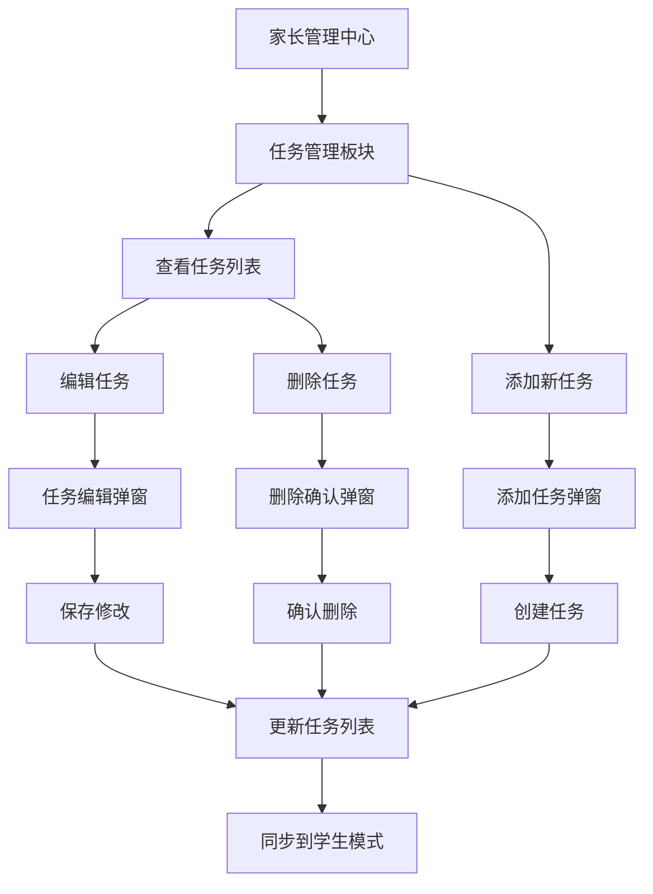

# 家长任务管理功能需求文档

## 1. 产品概述

为家长管理中心增加任务管理功能，让家长能够直接管理孩子的所有任务，包括编辑任务名称、调整奖励积分和删除任务。此功能将替换现有的"任务积分管理"板块，提供更直观和全面的任务管理体验。

## 2. 核心功能

### 2.1 用户角色
| 角色 | 使用权限 | 核心功能 |
|------|----------|----------|
| 家长用户 | 需要密码验证进入家长模式 | 可以查看、编辑、删除所有任务，添加新任务 |
| 学生用户 | 正常使用权限 | 可以查看和完成任务，但不能编辑任务属性 |

### 2.2 功能模块

我们的家长任务管理功能包含以下主要模块：

1. **任务管理板块**：任务列表显示、任务操作按钮、统计信息
2. **任务编辑功能**：编辑任务名称、调整积分奖励、修改任务类型
3. **任务删除功能**：删除确认对话框、批量删除选项
4. **添加任务功能**：新建任务表单、任务类型选择

### 2.3 页面详情

| 页面名称 | 模块名称 | 功能描述 |
|----------|----------|----------|
| 家长管理中心 | 任务管理板块 | 显示所有任务列表，包含任务名称、类型图标、积分奖励、完成状态。每个任务显示编辑和删除按钮 |
| 家长管理中心 | 任务统计信息 | 显示总任务数、已完成任务数、待完成任务数、总积分等统计数据 |
| 家长管理中心 | 添加任务按钮 | 提供添加新任务的入口，点击打开任务创建弹窗 |
| 任务编辑弹窗 | 任务信息编辑 | 编辑任务名称、选择任务类型、设置积分奖励（1-50分）、设置任务优先级 |
| 任务编辑弹窗 | 操作按钮 | 保存修改、取消编辑、删除任务按钮 |
| 添加任务弹窗 | 任务创建表单 | 输入任务名称、选择任务类型、设置积分奖励、设置优先级、添加任务描述 |
| 删除确认弹窗 | 确认对话框 | 显示要删除的任务信息，提供确认删除和取消按钮，防止误操作 |

## 3. 核心流程

**家长任务管理流程：**
1. 家长进入家长模式（需要密码验证）
2. 在家长管理中心查看任务管理板块
3. 查看所有任务列表和统计信息
4. 选择要编辑的任务，点击编辑按钮
5. 在弹窗中修改任务信息并保存
6. 或选择删除任务，确认删除操作
7. 或点击添加任务按钮创建新任务

**任务同步流程：**
1. 家长在任务管理中修改任务
2. 系统更新本地存储数据
3. 学生模式的任务列表自动同步更新
4. 保持数据一致性

## 4. 用户界面设计

### 4.1 设计风格
- **主色调**：蓝色系 (#007bff) 作为主色，绿色 (#28a745) 表示完成状态
- **辅助色**：灰色 (#6c757d) 用于次要信息，红色 (#dc3545) 用于删除操作
- **按钮风格**：圆角按钮，带有图标和文字
- **字体**：系统默认字体，标题使用 16px，正文使用 14px，辅助信息使用 12px
- **布局风格**：卡片式布局，清晰的分区和间距
- **图标风格**：使用 emoji 图标，直观易懂

### 4.2 页面设计概览

| 页面名称 | 模块名称 | UI元素 |
|----------|----------|---------|
| 家长管理中心 | 任务管理板块 | 标题使用📋图标，任务列表采用卡片式布局，每个任务卡片包含类型图标、任务名称、积分显示、状态标识、编辑按钮（✏️）、删除按钮（🗑️） |
| 家长管理中心 | 统计信息区域 | 使用网格布局显示统计卡片，包含数字和标签，使用不同颜色区分不同类型的统计 |
| 家长管理中心 | 操作按钮区域 | 添加任务按钮使用蓝色主色调，带有➕图标，位置醒目 |
| 任务编辑弹窗 | 表单区域 | 白色背景，圆角边框，包含输入框、下拉选择、数字输入等表单元素，按钮区域在底部 |
| 删除确认弹窗 | 确认对话框 | 简洁的对话框设计，红色删除按钮，灰色取消按钮，清晰的警告信息 |

### 4.3 响应式设计
- **桌面优先**：主要针对移动端设计，但保持在桌面端的良好显示效果
- **触摸优化**：按钮大小适合手指点击，间距合理防止误触
- **自适应布局**：任务列表和统计信息在不同屏幕尺寸下自动调整布局