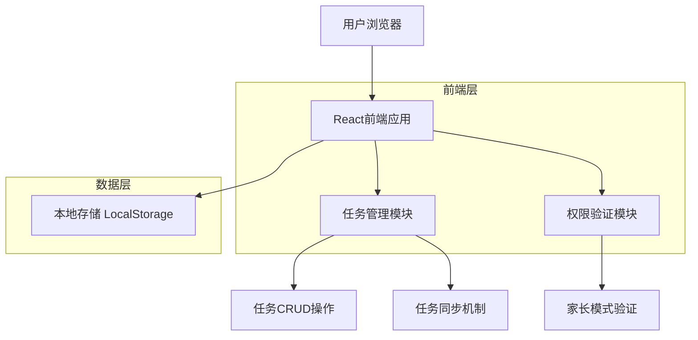
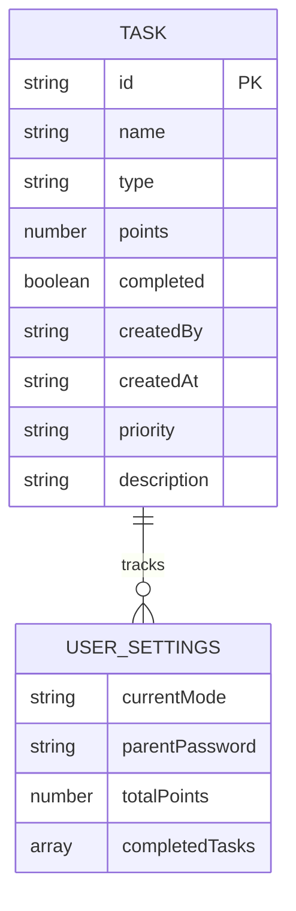

# 家长任务管理技术架构文档

## 1. 架构设计



## 2. 技术描述

- **前端**：原生 HTML5 + CSS3 + JavaScript ES6+
- **数据存储**：LocalStorage（浏览器本地存储）
- **UI框架**：无外部依赖，使用原生DOM操作
- **状态管理**：基于全局变量和LocalStorage的简单状态管理

## 3. 路由定义

| 路由 | 用途 |
|------|------|
| /home | 主页，显示任务列表和导航 |
| /parent | 家长管理中心，包含任务管理功能 |
| /tasks | 学生模式任务页面 |
| /profile | 个人中心页面，包含模式切换 |

## 4. API定义

### 4.1 核心数据结构

**任务对象 (Task)**
```javascript
{
    id: string,              // 任务唯一标识
    name: string,            // 任务名称
    type: string,            // 任务类型：'school', 'home', 'temp'
    points: number,          // 积分奖励 (1-50)
    completed: boolean,      // 完成状态
    createdBy: string,       // 创建者：'parent' 或 'student'
    createdAt: string,       // 创建时间
    priority: string,        // 优先级：'low', 'medium', 'high'
    description: string      // 任务描述（可选）
}
```

### 4.2 核心函数接口

**任务管理函数**
```javascript
// 获取所有任务
function getAllTasks(): Task[]

// 添加新任务
function addTask(task: Task): boolean

// 更新任务
function updateTask(taskId: string, updates: Partial<Task>): boolean

// 删除任务
function deleteTask(taskId: string): boolean

// 获取任务统计
function getTaskStats(): {
    total: number,
    completed: number,
    pending: number,
    totalPoints: number
}
```

**UI操作函数**
```javascript
// 显示任务管理界面
function showTaskManagement(): void

// 显示任务编辑弹窗
function showEditTaskModal(taskId: string): void

// 显示添加任务弹窗
function showAddTaskModal(): void

// 显示删除确认弹窗
function showDeleteConfirmModal(taskId: string): void

// 刷新任务列表显示
function refreshTaskList(): void
```

## 5. 数据模型

### 5.1 数据模型定义



### 5.2 数据定义语言

**LocalStorage 数据结构**
```javascript
// 任务数据存储
localStorage.setItem('tasks', JSON.stringify([
    {
        id: 'task_001',
        name: '完成数学作业',
        type: 'school',
        points: 10,
        completed: false,
        createdBy: 'parent',
        createdAt: '2024-01-15T10:00:00Z',
        priority: 'high',
        description: '完成第3章练习题'
    },
    {
        id: 'task_002',
        name: '整理房间',
        type: 'home',
        points: 15,
        completed: true,
        createdBy: 'parent',
        createdAt: '2024-01-15T09:00:00Z',
        priority: 'medium',
        description: '整理书桌和衣柜'
    }
]));

// 用户设置存储
localStorage.setItem('userSettings', JSON.stringify({
    currentMode: 'student',
    parentPassword: 'parent123',
    totalPoints: 150,
    completedTasks: ['task_002'],
    lastLoginDate: '2024-01-15'
}));

// 任务类型配置
const TASK_TYPES = {
    school: { name: '学校任务', icon: '📚', color: '#007bff' },
    home: { name: '家庭任务', icon: '🏠', color: '#28a745' },
    temp: { name: '临时任务', icon: '⚡', color: '#ffc107' }
};

// 优先级配置
const PRIORITY_LEVELS = {
    low: { name: '低', color: '#6c757d' },
    medium: { name: '中', color: '#ffc107' },
    high: { name: '高', color: '#dc3545' }
};
```

## 6. 实现要点

### 6.1 关键技术实现

1. **任务数据同步**：确保家长模式的修改能实时反映到学生模式
2. **权限控制**：只有在家长模式下才能编辑和删除任务
3. **数据验证**：对任务名称、积分范围等进行有效性验证
4. **用户体验**：提供加载状态、成功提示、错误处理等反馈

### 6.2 安全考虑

1. **输入验证**：对所有用户输入进行验证和清理
2. **权限验证**：确保只有通过家长密码验证的用户才能进行管理操作
3. **数据备份**：在重要操作前创建数据备份，支持撤销操作

### 6.3 性能优化

1. **懒加载**：任务列表按需加载，避免一次性加载过多数据
2. **缓存机制**：合理使用内存缓存，减少重复的DOM操作
3. **防抖处理**：对搜索和筛选功能进行防抖处理