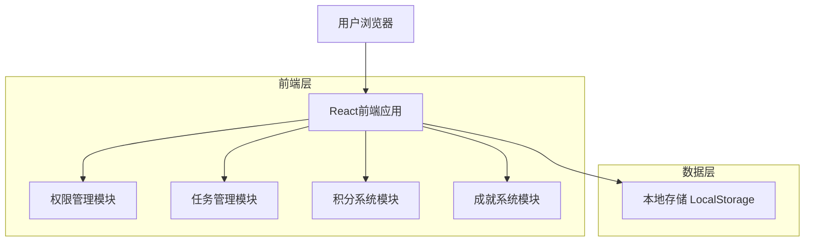

# 每日打卡应用 - 技术架构文档

## 1. 架构设计



## 2. 技术描述

- **前端**: HTML5 + CSS3 + 原生JavaScript
- **数据存储**: LocalStorage (本地存储)
- **UI框架**: 原生CSS + 响应式设计
- **权限管理**: 基于角色的访问控制 (RBAC)

## 3. 路由定义

| 路由 | 用途 |
|------|------|
| /home | 首页，显示今日任务和进度概览 |
| /tasks | 任务管理页面，支持添加、编辑、分类查看任务 |
| /stats | 数据统计页面，显示完成率、积分趋势等图表 |
| /shop | 积分商城页面，积分兑换虚拟奖励 |
| /profile | 个人中心页面，用户信息和设置 |
| /parent | 家长管理页面，需要密码验证进入 |

## 4. 核心模块设计

### 4.1 权限管理模块

**功能描述**: 实现学生和家长两种用户角色的权限分离

**核心API**:
```javascript
// 用户身份验证
function authenticateUser(password)

// 切换用户模式
function switchUserMode(mode) // 'student' | 'parent'

// 检查权限
function checkPermission(action, resource)

// 权限控制装饰器
function requirePermission(permission)
```

**权限矩阵**:
| 功能 | 学生权限 | 家长权限 |
|------|----------|----------|
| 查看任务 | ✅ | ✅ |
| 完成任务 | ✅ | ✅ |
| 添加任务 | ✅ | ✅ |
| 删除任务 | ❌ | ✅ |
| 修改积分 | ❌ | ✅ |
| 查看统计 | ✅ | ✅ |
| 管理奖励 | ❌ | ✅ |

### 4.2 任务管理模块

**功能描述**: 智能任务过滤和频率管理

**核心API**:
```javascript
// 获取今日任务
function getTodayTasks()

// 任务频率过滤
function filterTasksByFrequency(frequency, date)

// 任务模板管理
function getTaskTemplates()
function createTaskFromTemplate(templateId)
```

**任务频率类型**:
```javascript
const TASK_FREQUENCY = {
    DAILY: 'daily',           // 每日任务
    WEEKLY: 'weekly',         // 每周指定天
    MONTHLY: 'monthly',       // 每月指定日
    TEMPORARY: 'temporary'    // 临时任务
}
```

### 4.3 积分系统模块

**功能描述**: 积分计算、管理和历史记录

**核心API**:
```javascript
// 积分计算
function calculatePoints(taskId, completionTime)

// 积分管理 (家长权限)
function updateTaskPoints(taskId, points)

// 积分历史
function getPointsHistory(dateRange)

// 积分统计
function getPointsStatistics()
```

### 4.4 成就系统模块

**功能描述**: 成就定义、解锁条件和进度追踪

**成就定义**:
```javascript
const ACHIEVEMENTS = [
    {
        id: 'first_task',
        name: '初次尝试',
        description: '完成第一个任务',
        icon: '🎯',
        condition: (stats) => stats.completedTasks >= 1,
        points: 10
    },
    {
        id: 'streak_7',
        name: '七日坚持',
        description: '连续7天完成任务',
        icon: '🔥',
        condition: (stats) => stats.streakDays >= 7,
        points: 50
    }
    // ... 更多成就定义
]
```

## 5. 数据模型

### 5.1 用户数据模型
```javascript
const UserModel = {
    id: 'string',
    name: 'string',
    avatar: 'string',
    level: 'number',
    totalPoints: 'number',
    currentMode: 'student' | 'parent',
    createdAt: 'timestamp'
}
```

### 5.2 任务数据模型
```javascript
const TaskModel = {
    id: 'string',
    title: 'string',
    description: 'string',
    category: 'school' | 'home' | 'temp',
    frequency: 'daily' | 'weekly' | 'monthly' | 'temporary',
    frequencyConfig: {
        weekdays: 'number[]',  // 周任务：[1,3,5] 表示周一三五
        monthdays: 'number[]', // 月任务：[1,15] 表示每月1号和15号
        endDate: 'date'        // 临时任务截止日期
    },
    points: 'number',
    priority: 'high' | 'medium' | 'low',
    completed: 'boolean',
    completedAt: 'timestamp',
    createdAt: 'timestamp',
    createdBy: 'student' | 'parent'
}
```

### 5.3 积分记录模型
```javascript
const PointsRecordModel = {
    id: 'string',
    taskId: 'string',
    taskTitle: 'string',
    points: 'number',
    type: 'earn' | 'spend',
    description: 'string',
    createdAt: 'timestamp'
}
```

### 5.4 成就记录模型
```javascript
const AchievementRecordModel = {
    id: 'string',
    achievementId: 'string',
    unlockedAt: 'timestamp',
    progress: 'number' // 0-100
}
```

## 6. 本地存储设计

### 6.1 存储键值定义
```javascript
const STORAGE_KEYS = {
    USER_PROFILE: 'daily_checkin_user',
    TASKS: 'daily_checkin_tasks',
    POINTS_HISTORY: 'daily_checkin_points',
    ACHIEVEMENTS: 'daily_checkin_achievements',
    SETTINGS: 'daily_checkin_settings',
    PARENT_MODE: 'daily_checkin_parent_mode'
}
```

### 6.2 数据导出格式
```javascript
const ExportDataFormat = {
    version: '1.0',
    exportDate: 'timestamp',
    user: 'UserModel',
    tasks: 'TaskModel[]',
    pointsHistory: 'PointsRecordModel[]',
    achievements: 'AchievementRecordModel[]'
}
```

## 7. 安全设计

### 7.1 权限验证
- 家长模式密码验证（默认：123456）
- 敏感操作二次确认
- 权限检查中间件

### 7.2 数据保护
- 本地数据加密存储
- 防止恶意数据篡改
- 数据备份和恢复机制

## 8. 性能优化

### 8.1 前端优化
- 懒加载非关键资源
- 图片压缩和缓存
- CSS和JS代码压缩

### 8.2 数据优化
- 本地存储数据分片
- 定期清理过期数据
- 智能缓存策略

## 9. 兼容性支持

### 9.1 浏览器兼容
- iOS Safari 12+
- Android Chrome 70+
- 响应式设计适配

### 9.2 设备适配
- 手机端优先设计
- 平板设备适配
- 触摸操作优化

---

**文档版本**: V1.0  
**创建日期**: 2024年12月  
**技术栈**: HTML5 + CSS3 + JavaScript + LocalStorage