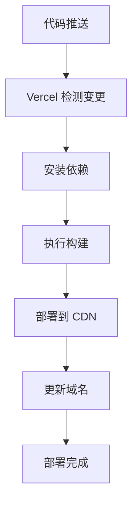

# Vercel 部署指南 - 每日打卡应用

## 🚀 快速部署

### 方法一：通过 Vercel CLI（推荐）

1. **安装 Vercel CLI**
```bash
npm i -g vercel
```

2. **登录 Vercel**
```bash
vercel login
```

3. **部署项目**
```bash
# 在项目根目录执行
vercel

# 或者直接生产部署
vercel --prod
```

4. **使用一键部署脚本**
```bash
./deploy.sh vercel
```

### 方法二：通过 Vercel 网站

1. 访问 [vercel.com](https://vercel.com)
2. 使用 GitHub/GitLab/Bitbucket 账号登录
3. 点击 "New Project"
4. 导入您的 Git 仓库
5. Vercel 会自动检测配置并部署

## ⚙️ 配置说明

### vercel.json 配置文件

```json
{
  "name": "meiridaka",                    // 项目名称
  "version": 2,                          // Vercel 配置版本
  "buildCommand": "npm run build:h5",    // 构建命令
  "outputDirectory": "dist/build/h5",    // 输出目录
  "installCommand": "npm install",       // 安装依赖命令
  "framework": null,                     // 框架类型（自动检测）
  
  // 路由配置
  "routes": [
    // 静态资源缓存（1年）
    {
      "src": "/static/(.*)",
      "headers": {
        "cache-control": "public, max-age=31536000, immutable"
      }
    },
    
    // 资源文件缓存
    {
      "src": "/(.*\\.(js|css|png|jpg|jpeg|gif|svg|ico|woff|woff2|ttf|eot))",
      "headers": {
        "cache-control": "public, max-age=31536000, immutable"
      }
    },
    
    // manifest.json 不缓存
    {
      "src": "/manifest.json",
      "headers": {
        "cache-control": "public, max-age=0, must-revalidate"
      }
    },
    
    // SPA 路由回退
    {
      "src": "/(.*)",
      "dest": "/index.html"
    }
  ],
  
  // 安全头设置
  "headers": [
    {
      "source": "/(.*)",
      "headers": [
        {
          "key": "X-Content-Type-Options",
          "value": "nosniff"
        },
        {
          "key": "X-Frame-Options", 
          "value": "DENY"
        },
        {
          "key": "X-XSS-Protection",
          "value": "1; mode=block"
        }
      ]
    }
  ]
}
```

## 🌍 环境变量配置

如果您的应用需要环境变量，可以在 Vercel 控制台设置：

1. 进入项目设置页面
2. 点击 "Environment Variables"
3. 添加所需的环境变量

常用环境变量示例：
```
NODE_ENV=production
API_BASE_URL=https://api.example.com
```

## 🔧 自定义域名

1. 在 Vercel 项目设置中点击 "Domains"
2. 添加您的自定义域名
3. 按照提示配置 DNS 记录

支持的域名类型：
- 子域名：`app.yourdomain.com`
- 根域名：`yourdomain.com`
- 通配符域名：`*.yourdomain.com`

## 📊 性能优化

### 1. 静态资源优化
- 自动压缩 JS/CSS
- 图片自动优化
- 全球 CDN 加速

### 2. 缓存策略
- 静态资源：1年缓存
- HTML：不缓存，确保更新及时
- API：可配置缓存策略

### 3. 构建优化
```json
{
  "build": {
    "env": {
      "NODE_OPTIONS": "--max_old_space_size=4096"
    }
  }
}
```

## 🔍 监控和分析

Vercel 提供内置的分析功能：

1. **性能监控**
   - 页面加载时间
   - Core Web Vitals
   - 用户体验指标

2. **访问统计**
   - 页面浏览量
   - 用户地理分布
   - 设备类型分析

## 🚨 常见问题

### 1. 构建失败
```bash
# 检查构建日志
vercel logs

# 本地测试构建
npm run build:h5
```

### 2. 路由问题
确保 `vercel.json` 中的路由配置正确，特别是 SPA 回退规则。

### 3. 静态资源 404
检查 `outputDirectory` 配置是否正确指向构建输出目录。

### 4. 环境变量未生效
确保在 Vercel 控制台正确设置了环境变量，并重新部署。

## 📈 部署流程



## 🎯 最佳实践

1. **使用 Git 集成**：连接 GitHub 仓库实现自动部署
2. **分支部署**：为不同分支设置不同的部署环境
3. **预览部署**：每个 PR 自动生成预览链接
4. **回滚机制**：出现问题时快速回滚到上一版本

## 📞 技术支持

- [Vercel 官方文档](https://vercel.com/docs)
- [Vercel 社区](https://github.com/vercel/vercel/discussions)
- [uni-app 部署指南](https://uniapp.dcloud.io/collocation/manifest?id=h5)

---

🎉 **恭喜！您的每日打卡应用现在可以通过 Vercel 快速部署了！**